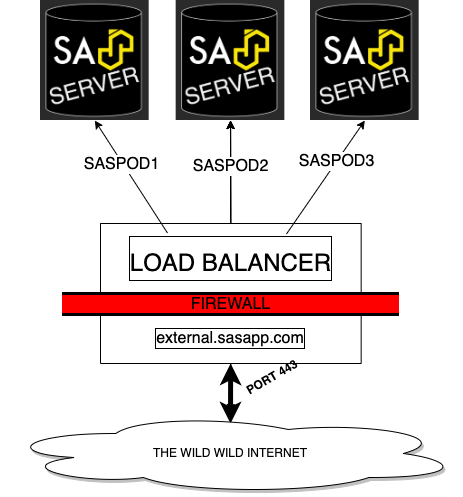
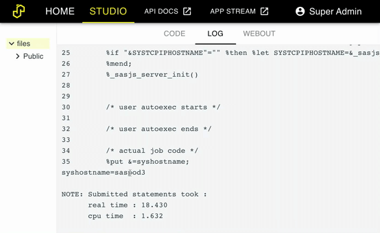

[SASjs Server](https://server.sasjs.io) does not ship with a load balancer.  However it does "play nicely" with existing load balancers such as nginx.

In this guide we will demonstrate how to configure a load balancer against three instances of SASjs Server.

Prerequisites:

* 3 functional and identical instances of SASjs Server (setup steps [here](/sasjs-server-on-vps)).
* A linux instance for the load balancer, with root access
* A domain with corresponding TLS certificates




## NGINX Basic Setup

SSH onto the load balancing server.  If nginx is not installed, install as follows:

```bash
sudo apt-get install nginx
```

Next, open the default configuration (`/etc/nginx/sites-available/default`) using your preferred editor (`nano`, `vim`) and replace the contents with the text below.

```
# List of backend SASjs server instances
#  (internal/private IP + port)
upstream mysasgrid {
  server 10.110.0.8:5000;
  server 10.110.0.11:5000;
  server 10.110.0.10:5000;
}

server {
  listen 80;
  location / {
    proxy_pass http://mysasgrid;
  }
}
```

And finally, restart nginx:

```
sudo service nginx restart
```

That's it!  You should now be able to access the SASjs Server instances from the domain of the load balancer.  Simply run `%put &=syshostname;` in Studio to see the domain of each node:




If you are having troubles with `service nginx restart` be sure to check the log file at `/var/log/nginx/error.log`.


## NGINX Setup with TLS

To apply TLS / https to the load balancer, you need to create a certificate and key.  The easiest way to do this is to use the Let's Encrypt service.  An example of how to do this is provided in [SASjs Server on VPS](/sasjs-server-on-vps) article.

Once you have your `fullchain.pem` and `privkey.pem` files, update the text below and use to replace the contents of `/etc/nginx/sites-available/default`.

```
upstream mysasgrid {
  server 10.110.0.8:5000;
  server 10.110.0.11:5000;
  server 10.110.0.10:5000;
}

server {
  listen              443 ssl;
  # domain of your load balancer
  server_name          demo.4gl.io;
  # location of your certificates
  ssl_certificate     /opt/certificates/fullchain.pem;
  ssl_certificate_key /opt/certificates/privkey.pem;

  location / {
    proxy_pass http://mysasgrid;
  }
}
```

Save, re-run `sudo service nginx restart` and voila - your load balancer is configured to use TLS 🔒🔒🔒

Note that the SSL encryption terminates here at the load balancer - the node traffic runs over http. If you do not trust your internal network, or if you are using external nodes, you may also configure SSL Passthrough - an article on that is available [here](https://www.cyberciti.biz/faq/configure-nginx-ssltls-passthru-with-tcp-load-balancing/).


