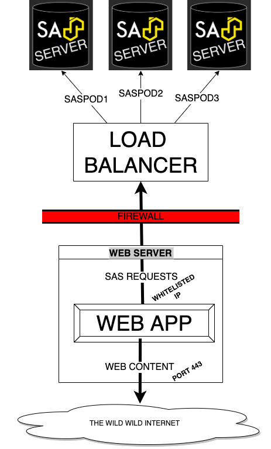

[SASjs Server](https://server.sasjs.io) does not ship with a load balancer.  However it does "play nicely" with existing load balancers - such as nginx.  This enables deployment in a similar topology to that of legacy SAS/IntrNet servers or Stored Process Web Apps.

In this guide we will demonstrate how to configure nginx against three backend instances of SASjs Server.

Prerequisites:

* 3 functional and identical instances of SASjs Server (setup steps [here](/sasjs-server-on-vps)).
* A linux VPS for the load balancer, with root access
* A domain with corresponding TLS certificates


## NGINX Basic Setup

SSH onto the load balancing server.  If nginx is not installed, install as follows:

```bash
sudo apt-get install nginx
```

Next, open the default configuration (`/etc/nginx/sites-available/default`) using your preferred editor (`nano`, `vim`) and replace the contents with the text below.

```
# List of backend SASjs server instances
#  (internal/private IP + port)
upstream mysasgrid {
  server 10.110.0.8:5000;
  server 10.110.0.11:5000;
  server 10.110.0.10:5000;
}

server {
  listen 80;
  location / {
    proxy_pass http://mysasgrid;
  }
}
```

Finally, restart nginx:

```
sudo service nginx restart
```

That's it! 🚀🚀🚀

<hr/>

You should now be able to access the SASjs Server instances from the domain of the load balancer.  Simply run `%put &=syshostname;` in Studio to see the domain of each node:


If you are having troubles be sure to check the log file at `/var/log/nginx/error.log`.


## NGINX Setup with TLS

To enable TLS (https) on the load balancer, you need to create a certificate and key.  The easiest way to do this is to use the Let's Encrypt service - an example is provided in [this article](/sasjs-server-on-vps).

Once you have your `fullchain.pem` and `privkey.pem`, update the text below and use to replace the contents of `/etc/nginx/sites-available/default` as follows:

```
upstream mysasgrid {
  server 10.110.0.8:5000;
  server 10.110.0.11:5000;
  server 10.110.0.10:5000;
}

server {
  listen              443 ssl;
  # domain of your load balancer
  server_name          demo.4gl.io;
  # location of your certificates
  ssl_certificate     /opt/certificates/fullchain.pem;
  ssl_certificate_key /opt/certificates/privkey.pem;

  location / {
    proxy_pass http://mysasgrid;
  }
}
```

Save, re-run `sudo service nginx restart` and voila - your load balancer is configured to use TLS 🔒🔒🔒

Note that the SSL encryption terminates here at the load balancer - the node traffic runs over http. If you do not trust your internal network, or you are using external nodes, you may wish to configure SSL Passthrough - an article on that is [here](https://www.cyberciti.biz/faq/configure-nginx-ssltls-passthru-with-tcp-load-balancing/).


## NGINX Load Balancing Algorithms

By default, nginx will send traffic to each server sequentially (Round Robin).  However there may be reasons to use a different algorithm - for example, if you have servers with varying capacity, or reliability.

Below are some examples of load balancing algorithms on nginx.

### Weight

You can assign specific weights to each node, to allow more traffic to be sent to the servers with higher capacity.

For instance:

```
upstream mysasgrid {
  server 10.110.0.8:5000 weight=1;
  server 10.110.0.11:5000 weight=2;
  server 10.110.0.10:5000 weight=6;
}
```

In this case, the second server will receive twice as much traffic as the first.  The third will receive six times more traffic than the first.

### Hash

By taking a hash of the IP of the request, you can route the requests for each visitor to the same SAS instance.  This is useful when your SAS app makes use of node-specific features, eg for session management.

Note that if a server is down, it may be marked as such in order to redirect the requests.

Example config:

```
upstream mysasgrid {
  ip_hash;
  server 10.110.0.8:5000;
  server 10.110.0.11:5000 down;
  server 10.110.0.10:5000;
}
```

In this example the second server is marked as down.


### Max Fails

By default (Round Robin) requests are blindly forwarded to servers that are down / unresponsive.  The Max Fails algorithm deals with this using two parameters:

* [`max_fails`](https://nginx.org/en/docs/http/ngx_http_upstream_module.html#max_fails) - the number of consecutive failures before the server is marked as down.
* [`fail_timeout`](https://nginx.org/en/docs/http/ngx_http_upstream_module.html#fail_timeout) - how long to wait before the server is assumed to be back up.

You can mix and match "Max Fails" with "Weight" and "Hash" algorithms.  Example:

```
upstream mysasgrid {
  ip_hash;
  server 10.110.0.8:5000 weight=1 max_fails=1 fail_timeout=10s;
  server 10.110.0.11:5000 max_fails=1 fail_timeout=1s;
  server 10.110.0.10:5000 weight=6 max_fails=2 fail_timeout=1h;
}
```

In this config:

* We are using IP hashing (each visitor will continue to use the same machine)
* The third server will get six times as much traffic as the other two (default weight is 1)
* If the third server fails twice, it will be out of action for 1 hour
* If the first server fails once, it is out of action for 10 seconds


As you can see, NGINX is highly configurable.  Further options / algorithms (such as [least_time](https://nginx.org/en/docs/http/ngx_http_upstream_module.html#least_time) or [least_conn](https://nginx.org/en/docs/http/ngx_http_upstream_module.html#least_conn)) are available if you take out a commercial subscription with nginx.

## Deploying SAS Apps on Load Balanced Platforms

The key thing to remember is that the load balancer config above does not differentiate between web requests and SAS requests.  Therefore your app must be deployed to ALL the nodes in the cluster.

If you would like to take security one step further, you could consider deploying the load balancer BEHIND the frontend application.  In this way, you can prevent end users from calling SAS services directly - by whitelisting the IP of the web server.  A topology for this is shown below:



This approach will only work if you are running an actual web server (eg NodeJS application) and frontend.  It won't work for single page applications.

If you're interested to deploy such a solution, or you would like to partner with our team to deliver SAS Apps in other configurations, do [get in touch](/contact/)!
