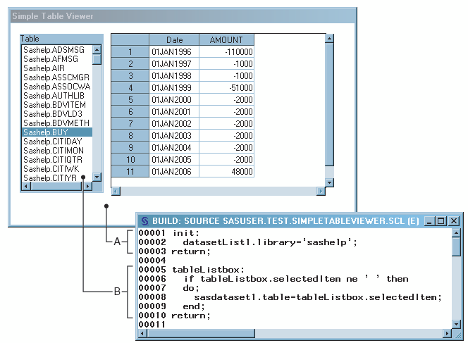

Before SAS Studio, and even EG (but after display manager), there was a desktop application used exclusively for accessing SAS. It was known as Base SAS, and within it there was an application development facility known as SAS/AF.

This enabled point and click development of user interfaces, in a similar way to User Forms in VBA Excel. The application logic was driven by an object-orientated language known as SCL. SCL code was compiled, saved in catalogs, and the resulting application was often stored on a network drive and launched by end users.

## Legacy SAS/AF SCL Apps

It's fair to say these applications were a massive success, as many of them are still alive today - surviving decades of technological evolution! Still, as organisations have matured, the following challenges transpired:

- **Security**. Especially of source files, and password management.
- **Scalability**. Deploying SCL apps to each client machine is non-trivial.
- **Support**. The original developers are usually long gone, and SCL resources are few and far between.
- **User Experience**. This was an 80s product and.. it shows.

So, what to do about it? These applications are often complex, business critical, and heavily embedded in the SAS infrastructure. Well, as it happens, there is a tidy solution, quick to implement, and keeps everything within SAS. So what is it?

## HTML5 SAS Web Apps

Web apps are a natural migration for legacy AF. Secured by your existing enterprise authorisation mechanism (SASLogon), they are highly scalable, easy to support, quick to build, and very user friendly.

When building web apps on SAS, it's super important to separate the frontend logic (the domain of a web developer) from the backend (idempotent, stateless SAS programs). A typical modernisation project will begin by creating UX diagrams, wireframes, and screenshots to mockup the visuals and diagramming the application logic. This means that the gory details of the AF part, ie all the `call display()` and `call next()` routines (and associated catalog entries) are effectively disregarded, and completely rebuilt using modern design methods and javascript frameworks.

But what about the data logic? All the SLISTS, SCL programs, subroutines and methods? The good news is that **much of this can be re-used**. The fact is that SCL is based on, and works very similarly to, good old base SAS. This led to the development of the SCL Transcoding Kit, a framework / approach that lets you migrate SCL entries directly over to SAS (eg to run in a SAS 9 Stored Process or Job Execution Service on Viya), without the need for an AF License.

## Running SCL in SAS Studio

`vimeo: https://vimeo.com/367240430`

The full list of supported functions includes:

- `clearlist()` Empty a list
- `copylist()` Copy a list
- `delitem()` Deletes an item from an SCL list
- `dellist()` Deletes a list
- `delnitem()` Deletes a named item from an SCL list
- `format()` Verifies that the specified format is valid
- `getitemc()` Returns a value identified by its position in an SCL list
- `getiteml()` Returns a value identified by its position in an SCL list
- `getitemn()` Returns a value identified by its position in an SCL list
- `getnitemc()` Return a value identified by name in an SCL list
- `getniteml()` Return a value identified by name in an SCL list
- `getnitemn()` Return a value identified by name in an SCL list
- `insertc()` Insert a value into an SCL list
- `insertl()` Insert a value into an SCL list
- `insertn()` Insert a value into an SCL list
- `itemtype()` Returns the type of an item in an SCL list
- `listlen()` Returns the length of an SCL list
- `lvarlevel()` Fills a list with unique values from a table column
- `makelist()` Creates an SCL list
- `nameditem()` Returns the index of a named item in a list
- `nameitem()` Returns the name of an item in an SCL list
- `putlist()` Displays the contents of an SCL list in the LOG window
- `savelist()` Stores SCL list items in a dataset
- `searchc()` Search for a value in an SCL list and return its position
- `searchn()` Search for a value in an SCL list and return its position
- `setitemc()` Store a value at an indexed position in an SCL list
- `setitemn()` Store a value at an indexed position in an SCL list
- `setnitemc()` Assign a value to a named item in an SCL list
- `setniteml()` Assign a value to a named item in an SCL list
- `setnitemn()` Assign a value to a named item in an SCL list
- `sortlist()` Sorts the items in an SCL list by value or by name

Other than the `fcmp` library (referenced in the video above), this kit also lays out the process for exporting all the lists into a database, handling methods (with overloadable signatures), and migrating SCL entries into SAS code (hence, eradicating the use of catalogs).

Do you have legacy AF / SCL you'd like modernised? We'd love to help. Do [get in touch](https://sasapps.io/contact-us) for a no-obligation chat.

## Additional resources

- LinkedIn [Article](https://www.linkedin.com/pulse/easy-af-scl-modernisation-html5-sas-allan-bowe)
- SAS AF/SCL [Slides](https://slides.com/allanbowe/sasaf)
- Info on [SLISTS](https://www.rawsas.com/slists-scl-lists-an-overview)
