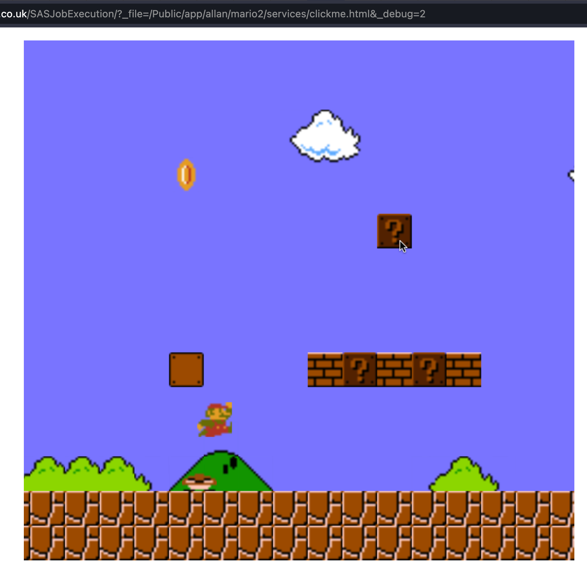

SAS Streamed Apps are served directly from the SAS logical folder tree - ie SAS Drive in Viya or the Metadata BIP folder in SAS 9.  This is highly convenient - there's no need for web server access, nor even a filesystem, and they can be deployed easily in a few lines of code.

This article will demonstrate the concept of a SAS-Streamed app using a Nintendo classic - Super Mario.  The app will work on both SAS 9 or Viya.



Before we begin - lets take a look at some of the _disadvantages_ of SAS-Streamed apps:

* Performance.  Because every asset is served from the SAS folder tree (App Server), response times are slow.  However, assets are also cached so subsequent requests are fast.
* Complexity.  In order to 'convert' a regular app into a streamed app, there is a compilation process.  It works well but it's not 100% perfect (yet).

The main reasons for using this approach would be:

* You don't have web server access
* You would like to create apps that can be _very_ easily deployed

Right - lets get started!

## Prerequisites

Our demo will make use of the tools below - these need to be installed locally (on your desktop / laptop).

* [GIT](https://sasjs.io/windows/#git)
* The [SASjs CLI](https://cli.sasjs.io/installation)
* [VS Code](https://sasjs.io/windows/#vscode) (optional - but recommended)

## Setup

The first thing to do is to clone the example project from github, as follows:

```
git clone https://github.com/sasjs/mario
cd mario
```

The next step is the configuration.  This can be found in the `sasjsconfig.json` file, under the `sasjs` folder.  The following items should be changed:

* `defaultTarget` - enter "sas9" or "viya" depending on the type of SAS server you are using
* `appLoc` - within your chosen target (either sas9 or viya) adjust the appLoc to your needs.  This represents the _root_ folder under which the app will be deployed.
* `serverUrl` - the full server (including port) of your target machine.


## Compilation

Compilation is the process of taking all the source files (ie your web frontend, and any SAS-powered web services) and preparing them for deployment.  For SAS 9, all content is served through self-contained Stored Processes - so any binary content must be base-64 encoded.  Also, prior to the build, all references (eg to images, css files etc) must be converted from relative paths, to fully qualified paths - ie to the relevant location in the SAS logical folder tree.

Fortunately you don't have to do any of this!  It can be achieved with a single command:

```
sasjs compile
```

The exact settings for this process (source / target folder path, index.html rename, etc) can all be adjusted.  More information [here](https://sasjs.io/frontend-deployment/#streaming-app-configuration).

For the Mario game you can see all the files under the `src` folder.  If you are building your own streamed app, you'd place your own content in this folder instead.  Ensure all file paths are relative, all web content is in the same folder, and that your app starts from a file called `index.html`.

## Build

The build part involves taking all the compiled assets and preparing a single file for deployment.  Two file types are always prepared:

* JSON - used in Viya for deployment with REST APIs (client/secret required)
* SAS - can be executed in both SAS 9 and Viya

The great thing about the generated SAS program is that it can be executed by ANY user of SAS to create the app.  To adjust the target location, simply configure the `appLoc` macro variable at the start of the program.  You could have the app deployed to the home directory on SAS 9 for instance, by setting:

```sas
%let apploc=/User Folders/&sysuserid/My Folder;
```

## Deploy

For manual deployment, you can just execute the aforementioned SAS program from `sasjs build` by copy pasting into SAS Studio or Enterprise Guide.  For automated deployment, authentication is required.  For this, simply run the below and follow the prompts:

```
sasjs auth
```

If you are deploying to Viya, you will need a Client and Secret.  If you are deploying to SAS 9, you will need a runner in your home folder.  If you'd like to use SAS encoded passwords, there is also a server change required.  For more information, see docs for [sasjs auth](https://cli.sasjs.io/auth).

Once you're authenticated, you're ready to auto-deploy!

```
sasjs deploy
```

When the `deployServicePack` attribute in the `sasjsconfig.json` file is `true`, the above command will deploy all the services using either the JSON file (if Viya) or the SAS program (if SAS 9).

The URL for the app will also be printed to the console window.


## Summary

In this walkthrough we installed some prerequisites, cloned an open source GIT repo, and deployed to our SAS server.  The compile/build/deploy process will work for almost any SAS app, and is optimised for macro-driven SAS web services also.

If you'd like to support building web apps on SAS, and especially if you'd like to partner with us on a project to deliver apps on SAS, do [get in touch](/contact)!

