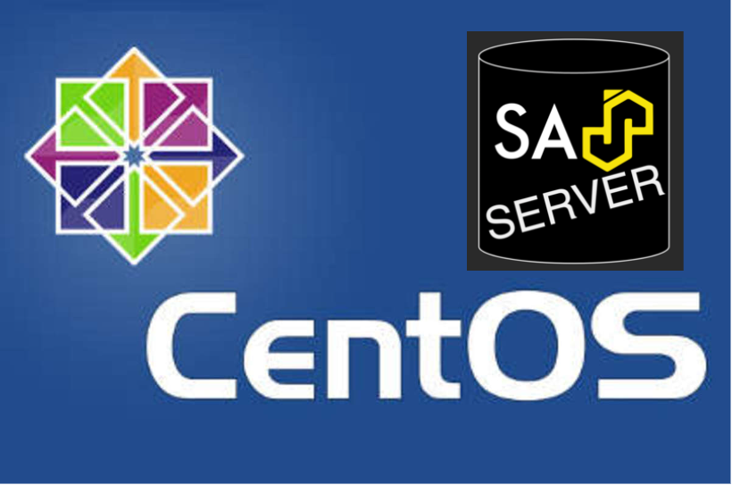
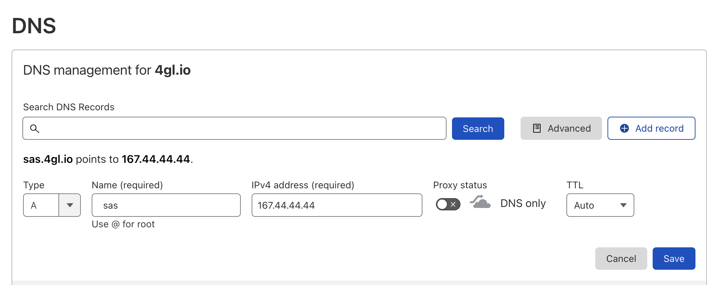

SAS 9 on Centos may not be officially supported by SAS Institute, but it is supported by the SAS Apps team!  At least, we can support the SASjs Server component.

This is a complete guide to setting up SASjs Server on CentOS 7.  A SAS runtime is a prerequisite, and a guide to installing that is available [here](https://rawsas.com/sas-centos/).  A guide to installing SASjs Server on Debian / Ubuntu type images is available [here](https://sasapps.io/sasjs-server-on-vps)



## Pre-Requisites

Before you get started, be sure you can obtain the following:

* The IP address of your VPS, with root SSH access, eg: `167.44.44.44`
* A working installation of SAS (or WPS)
* A domain (and access to the DNS panel), eg `mysas.mycompany.com`
* A MongoDB connection string (you can provision one locally or use a free cloud instance)


## Server Setup

Let's get this machine configured! First we log in as root, eg:

```bash
# Enter as sudo-enabled user using YOUR new server IP address
ssh user@167.44.44.44
```

Next, we create a unix group (`sas`) and create the system user account / home directory:

```bash
# Create a sas group
sudo addgroup sas
# Make the user account (eg sasjssrv) and add to sas group
sudo adduser sasjssrv -G sas
```


## TLS / SSL

We can generate https certificates using `certbot`.  Since `certbot` is packaged as a snap, we'll also install `snapd`.

```bash
# Add EPEL repository
sudo yum install epel-release
sudo yum upgrade
# Install snapd
sudo yum install snapd
# Enable snap communication socket
sudo systemctl enable --now snapd.socket
# Create symbolic link
sudo ln -s /var/lib/snapd/snap /snap
# Now, log out of the session and log back in
```

Now we are back in the session we can install certbot:

```
# Remove any previous installation
sudo yum remove certbot
# Install Certbot.
sudo snap install --classic certbot
# Make symlink
sudo ln -s /snap/bin/certbot /usr/bin/certbot
```

Before proceeding further, it is necessary to first update your DNS and add an "A record" pointing to your server IP.



Once this is done, we can launch certbot.

```
# provide domain to prompt WITHOUT https prefix, eg mysas.mycompany.com
sudo certbot certonly --standalone

# ensure members of the sas group can access the certs
# update the paths below according to the actual domain!
mkdir /opt/certificates
ln -s /etc/letsencrypt/live/YOURDOMAIN.com /opt/certificates
cd /etc/letsencrypt/live/YOURDOMAIN.com
cp fullchain.pem /opt/certificates/fullchain.pem
cp privkey.pem /opt/certificates/privkey.pem
chgrp -R sas /opt/certificates
chmod -R 755 /opt/certificates
```

## SASjs Installation & Configuration

The rest of the installation is exactly as described in [this article](https://sasapps.io/sasjs-server-on-vps) (from "SASjs Installation & Configuration" onwards).

